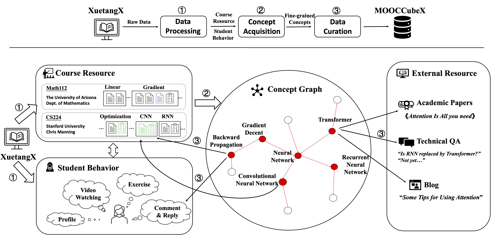
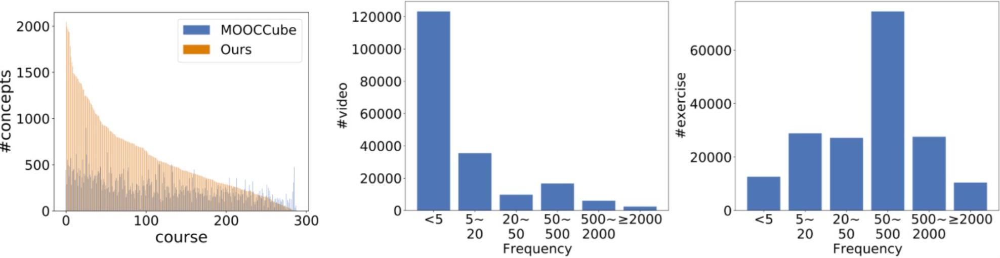

# MOOCCubeX 

[Paper](https://lfs.aminer.cn/misc/moocdata/publications/mooccubex.pdf) | [中文版](./README-cn.md)

MOOCCubeX is maintained by the the Knowledge Engineering Group of Tsinghua Univerisity, and supported by [XuetangX](https://www.xuetangx.com/), one of the largest MOOC websites in China. This repository consists of 4,216 courses, 230,263 videos, 358,265 exercises, 637,572 fine-grained concepts and over 296 million raw behavioral data of 3,330,294 students, for supporting the research topics on adaptive learning in MOOCs. 

We summarize the contributions of MOOCCubeX as follows:

* High Coverage: MOOCCubeX obtains diverse MOOC resources and external educational resources, as well as the data records of the students' learning, exercising and discussion.
* Large-scale: Compared with other open-access educational data repository, the scale of MOOCCubeX is larger, thereby supporting the exploration of deep models with high data requirements.
* Concept-centric: Heterogeneous data is organized using fine-grained concepts, which makes resources more relevant and easier to represent, find and model.

## News !!

* The prerequisite relations of mathematics, psychology and Computer science are refined !!
* Our paper is submitted to CIKM2021 resource track !!
* The MOOCCubeX Dataset Builder toolkit is updated !!
* Our paper is accepted by CIKM2021 resource track !!

## Repository Framework

The framework of MOOCCubeX is shown as bellow.



The data of MOOCCubeX are organized with a large fine-grained concept graph. The resources of MOOCCubeX are listed in the tables.

The course resources (more details are introduced in [course.md](./docs/course-en.md)).

| Course Resource Type | Description | Download | Size |
| -------------------- | ----------- | -------- | ---- |
| Course Info          | Course video and exercise organization. | [entities/course.json](https://lfs.aminer.cn/misc/moocdata/data/mooccube2/entities/course.json) | 43M |
| Video                | Video name and captions. | [entities/video.json](https://lfs.aminer.cn/misc/moocdata/data/mooccube2/entities/video.json) | 580M |
| Exercise              | [A group of problems](./docs/course-en.md#exercise) of the course | [relations/exercise-problem.txt](https://lfs.aminer.cn/misc/moocdata/data/mooccube2/relations/exercise-problem.txt) | 129M |
| Problem             | Practice problems of a group of exercise. | [entities/problem.json](https://lfs.aminer.cn/misc/moocdata/data/mooccube2/entities/problem.json) | 1.2G |
| School               | School information. | [entities/school.json](https://lfs.aminer.cn/misc/moocdata/data/mooccube2/entities/school.json) | 613K |
| Teacher              | Teacher information. | [entities/teacher.json](https://lfs.aminer.cn/misc/moocdata/data/mooccube2/entities/teacher.json) | 8.7M |
| Field/Discipline     | The fields a course belongs to. Annotated by human. | [relations/course-field.json](https://lfs.aminer.cn/misc/moocdata/data/mooccube2/relations/course-field.json) | 62K |

The student behavioral data (more details are introduced in [user.md](./docs/user-en.md)).

| Student Behavior Type | Description | Download | Size |
| --------------------- | ----------- | -------- | ---- |
| Student Profile       | User id, school, course register order, etc. | [entities/user.json](https://lfs.aminer.cn/misc/moocdata/data/mooccube2/entities/user.json) | 770M |
| Video Watching        | The speed and jumps of time of users watching video. | [relations/user-video.json](https://lfs.aminer.cn/misc/moocdata/data/mooccube2/relations/user-video.json) | 3.0G |
| Exercising            | Users doing exercise problems. | [relations/user-problem.json](https://lfs.aminer.cn/misc/moocdata/data/mooccube2/relations/user-problem.json) | 21G |
| Comment               | Users' comment on a video or an exercise. | [entities/comment.json](https://lfs.aminer.cn/misc/moocdata/data/mooccube2/entities/comment.json) | 2.1G |
| Reply                 | Users' replies on comments of other users. | [entities/reply.json](https://lfs.aminer.cn/misc/moocdata/data/mooccube2/entities/reply.json) | 50M |
| Xiaomu        | User interaction with Xiaomu (the QA bot of XuetangX). | [relations/user-xiaomu.json](https://lfs.aminer.cn/misc/moocdata/data/mooccube2/relations/user-xiaomu.json) | 9.7M |

The fine-grained concepts and their links with other types of MOOC resources, as well as the external resources are introduced in concept.md.

| Concept and Links                      | Description | Download | Size |
| -------------------------------------- | ----------- | -------- | ---- |
| Concept                                | Concepts extracted from video captions. | [entities/concept.json](https://lfs.aminer.cn/misc/moocdata/data/mooccube2/entities/concept.json) | 156M |
| Concept-prerequisite    | Prediction and human annotation of prerequisites of Psychology, Math and Computer Science. | [prerequisites/psy.json](https://lfs.aminer.cn/misc/moocdata/data/mooccube2/prerequisites/psy.json) [prerequisites/math.json](https://lfs.aminer.cn/misc/moocdata/data/mooccube2/prerequisites/math.json) [prerequisites/cs.json](https://lfs.aminer.cn/misc/moocdata/data/mooccube2/prerequisites/cs.json) | 87M 59M 133M |
| Concept-course                         | Linked concepts of a course. | [relations/concept-course.txt](https://lfs.aminer.cn/misc/moocdata/data/mooccube2/relations/concept-course.txt) | 19M |
| Concept-video                          | Linked concepts of a video. | [relations/concept-video.txt](https://lfs.aminer.cn/misc/moocdata/data/mooccube2/relations/concept-video.txt) | 39M |
| Concept-problem                        | Linked concepts of a problem. | [relations/concept-problem.txt](https://lfs.aminer.cn/misc/moocdata/data/mooccube2/relations/concept-problem.txt) | 1.3M |
| Concept-comment                        | Linked concepts of a comment. | [relations/concept-comment.txt](https://lfs.aminer.cn/misc/moocdata/data/mooccube2/relations/concept-comment.txt) | 1.2M |
| Concept-others                         | Linked concepts of [other resource](./docs/concept-en.md#entitiesotherjson). | [relations/concept-other.txt](https://lfs.aminer.cn/misc/moocdata/data/mooccube2/relations/concept-other.txt) | 19M |

## Toolkit

We provide 2 toolkits for convenient usage. They are built for the refinement or DIY employment of our data.

* MOOCCubeX Dataset Builder

  | Name | Description | Usage Example |
  | ------------ | --------------------- | ------------------------- |
  | [download_dataset.sh](./scripts/download_dataset.sh) | Download the full dataset. | `./scripts/download_dataset.sh` |
  | [count.sh](./scripts/count.sh) | Count the number of courses/videos/... | `./scripts/count.sh` |
  | [user_freq_histgram.py](./scripts/user_freq_histgram.py) | Plot usage frequency of videos/problems/... (Figure 4 in paper) | `python3 scripts/user_freq_histgram.py` |
  | [concept_course.py](./scripts/concept_course.py) | The script used to generate `relations/concept-course.txt`. | `python scripts/concept_course.py` |
  | [concept_finder.sh](./scripts/concept_finder.sh) | Find [`ccid`](./docs/course-en.md#video)s related to the given concept. | `./scripts/concept_finder.sh K_晶体三极管组态放大器_电子科学与技术` |
  | [course_info_finder.sh](./scripts/course_info_finder.sh) | Find course information whose name contains the given string | `./scripts/course_info_finder.sh 数据结构` |
  | [video_viewed_by_user_and_course.sh](./scripts/video_viewed_by_user_and_course.sh) | Get all [`resource_id`s](./docs/course-en.md#resource) of videos viewed by a given user of a given course | `./scripts/video_viewed_by_user_and_course.sh U_94015 C_1824928` |
  | [problems_by_user.sh](./scripts/problems_by_user.sh) | Get all problems attempted to solve by a given user. | `./scripts/problems_by_user.sh U_10000835` |
  | [concepts_of_video.sh](./scripts/concepts_of_video.sh) | Get all concepts of given video | `./scripts/concepts_of_video.sh V_479945` |
  | [who_replied.sh](./scripts/who_replied.sh) | Get all other users who replied a given user's comment | `./scripts/who_replied.sh U_10006544` |

_Some tools above have dependency on [`jq`](https://stedolan.github.io/jq/) or Python packages like `matplotlib` and `tqdm`._

* MOOCube Concept Helper

  * Concept Extraction Pipeline: https://github.com/yujifan0326/Concept-Acquisition-Pipeline
  * Prerequisite Discovery: https://github.com/luogan1234/prerequisite-prediction-co-training

## Hints and Features

MOOCCubeX has some statistical features of its concepts and behavirol data.

* MOOCCubeX contains more fine-grained concept compared with the previous version MOOCCube.
* The video watching behaviors are long-tail, while the exercising is normal distribution.



## Reference

```bib
@inproceedings{yu2021mooccubex,
  title={{MOOCCubeX}: A Large Knowledge-centered Repository for Adaptive Learning in {MOOCs}},
  author={Yu, Jifan and Wang, Yuquan and Zhong, Qingyang and Luo, Gan and Mao, Yiming and Sun, Kai and Feng, Wenzheng and Xu, Wei and Cao, Shulin and Zeng, Kaisheng and others},
  booktitle={Proceedings of the 30th ACM International Conference on Information \& Knowledge Management},
  pages={4643--4652},
  year={2021}
}
```

